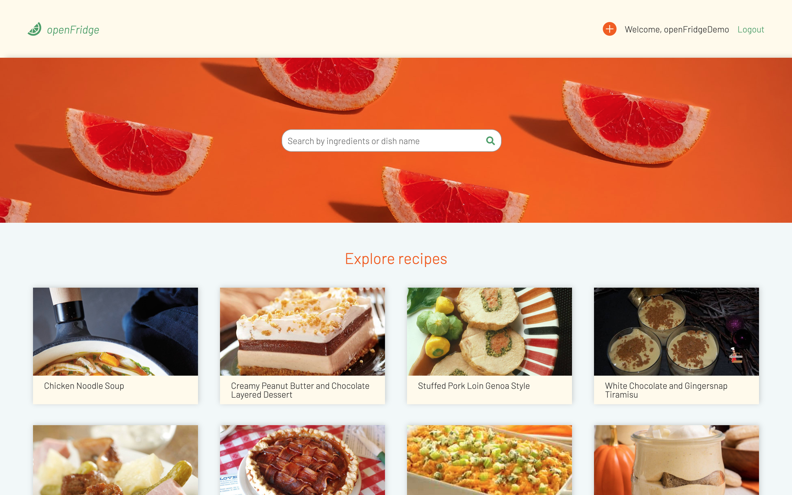
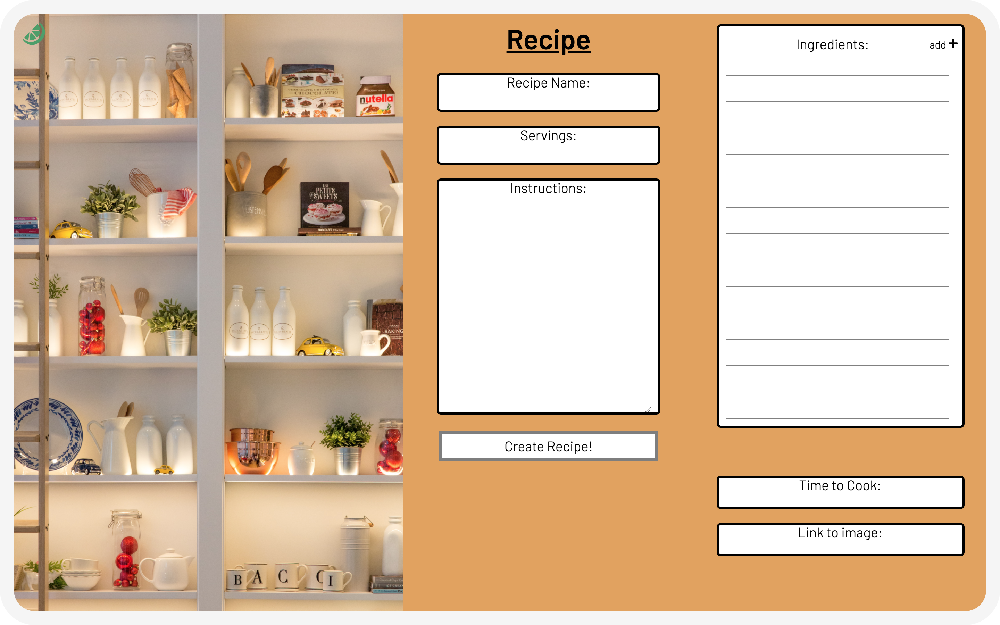
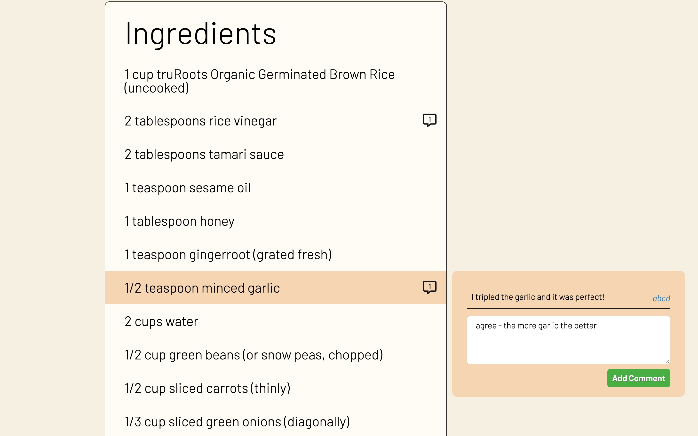

# Overview

openFridge is an app that helps you find recipes based on ingredients you have in your kitchen.

Out of ideas for dinner or have left-overs you don’t know what to do with? openFridge allows you to enter the ingredients you have in your kitchen and find fresh recipe ideas. With a display of vibrant dishes, you will be able to get a visual taste of what you want.

As a registered user on our free app, you’ll be able to pin the dishes you enjoyed most, share your personal recipes with others, and leave tips & comments for others.


# Team 

* `Backend Lead`: Eric Lo
* `Frontend Lead`: Tieulam Thai (Co-Team Lead)
* `Flex 1`: Keely Lee
* `Flex 2`: Daniel Gorter (Co-Team Lead)

# Functionality

* ### Users
    * Users can register, login, and logout
    * Certain functionality, such as pinning or uploading recipes, only available when logged in
    * Users can openly browse recipes when not logged in

  |  
:-------------------------:|:-------------------------:
signup | login

* ### Recipe Searching & Browsing
    * Users can explore and browse recipes on the homepage
    * Users can search by ingredient or ingredients
    * Users can upload their own recipes

  |  
:-------------------------:|:-------------------------:
explore recipes | create recipe

* ### Recipe Viewing & Interaction
    * Users can add comments / annotations to individual recipe ingredients or instructions
    * Users can also comment on the recipe as a whole
    * Users can pin/save recipes to their profile 

  |  
:-------------------------:|:-------------------------:
pinning a recipe | comments
# Technologies

* **MERN stack**: 
    * `MongoDB` database using Atlas hosting service
    * `Express.js` server-side JavaScript framework
    * `Node.js` server-side JavaScript runtime environment with `npm` package manager
    * `React` with Redux, frontend JavaScript framework
* [`recipe-scraper`](https://www.npmjs.com/package/recipe-scraper): scrapes recipe pages from websites such as Yummly or AllRecipes and returns a JSON object with the recipe data. 
    * We created a custom utility to scrape the Yummly sitemap for recipe URLs, which we combined with `recipe-scraper` to store thousands of recipes in JSON files. We also built a utility to seed our database using this recipe data at any time.
* [`ingredientparser`](https://www.npmjs.com/package/ingredientparser): parses an ingredient string, returning an object with quantity, unit, and ingredient name. 
    * We used this primarily for distilling the ingredient name, to make searching by ingredient more straightforward.
* [`pure-react-carousel`](https://github.com/express-labs/pure-react-carousel): library of composable React components to create carousels
    * We used this for our homepage, for displaying recipes to browse & search results. Behind the scenes, we created an infinite carousel by fetching more recipes before the user reaches the end of the carousel.
* Other dependencies include: [mongoose](https://www.npmjs.com/package/mongoose) (ORM for MongoDB), [axios](https://www.npmjs.com/package/axios) (server-side AJAX requests), [bcryptjs](https://www.npmjs.com/package/bcryptjs) (hashing and salting passwords), [body-parser](https://www.npmjs.com/package/body-parser) (parsing HTTP requests), [jsonwebtoken](https://www.npmjs.com/package/jsonwebtoken) / [jwt-decode](https://www.npmjs.com/package/jwt-decode) / [passport](https://www.npmjs.com/package/passport) / [passport-jwt](https://www.npmjs.com/package/passport-jwt) (user auth), [concurrently](https://www.npmjs.com/package/concurrently), [validator](https://www.npmjs.com/package/validator), [@material-ui/core](https://www.npmjs.com/package/@material-ui/core), & [node-sass](https://www.npmjs.com/package/node-sass)

# Challenges 

### Sorting search results

Filtering by ingredients wasn't too difficult; it just required some RegEx matching. The tough part was sorting the results by relevance. It took a lot of combing through the MongoDB documentation for aggregation operators and experimenting with ways of combining them, but we eventually hacked out something that works (well enough).

We start by taking our results -- all the matching recipes -- and adding a temporary field `ingredientsWeight` to each recipe; this will hold the running total score for the recipe. The more important the ingredients are in the recipe, the higher the score. It starts at 0:
```
this.results.addFields({
      ingredientsWeight: 0
    });
```
Next, we iterate through each searched ingredient. If the ingredient appears in the dish name, add a point to the running total, and if the searched ingredient appears at the end of the full ingredient name, add another point (more on these later):
```   
ingredients.forEach(ing => {   
  this.results.addFields({
    ingredientsWeight: { $add: [ 
      "$ingredientsWeight", 
      [0/1 points for appearing in dish name],
      [0/1 points for appearing at end of ingredient string]
    ]}
  })
});
```
Now, let's look at how we produce the 0 or 1 points for appearing in the dish name:
```
{
  $cond: {
    if: {
      $regexMatch: {
        input: "$name",
        regex: new RegExp(ing, "i")
      }
    },
    then: 1,
    else: 0
  }
},
```
Here, we use the MongoDB `$cond` operator to (1) check if the dish name includes the ingredient using RegEx matching, (2) if so, return 1, and (3) if not, return 0. Fairly straightforward.

Next, let's look at generating the 0 or 1 points for the searched ingredient appearing at the end of the full ingerdient name. A bit about why we chose that as a criterion: it was inspired by a memory from linguistics class, that in English the dominant noun of a noun phrase usually appears at the end of the phrase. After that, it was trial and error to see if that criterion actually works to sort real examples, and for the most part it does: if searching for `apple` for instance, `apple juice` gets 0 points, whereas `large apple` gets 1 point.
```   
{
  $min: [
    {
      $size: {
        $filter: {
          input: "$ingredients",
          as: "ing",
          cond: {
            $regexMatch: {
              input: "$$ing.name",
              regex: new RegExp(`\\b${ing}s?$`, "i")
            }
          }
        }
      }
    },
    1
  ]
}
```
We start by filtering the ingredients of a given recipe using a RegEx expression that captures the pattern we want (searched ingredient appearing at the end of ingredient name, as its own word). We get the size of the outputted array (the number of matches), and then take the minimum between that size and 1; so if there's at least one match, we get 1, if not, we get 0. Kind of a hacky method, but it works to get us our integer.

So, we've added up our score. Finally, we sort by `ingredientsWeight` (and secondarily by `id` so that the same search produces the same results every time), and of course remove that weighting field since we don't need it on the frontend:
```
this.results
  .sort({ingredientsWeight: -1, _id: 1})
  .append({ $unset: "ingredientsWeight" });
```

# Next Steps
* Ensure a consistently responsive design that scales to different screen sizes
* Allow users to upvote and downvote recipes
* Rank recipes / weight search results based on number of pins / likes
* Filter recipes in more ways: dietary restrictions, category (breakfast, dinner, etc), etc

